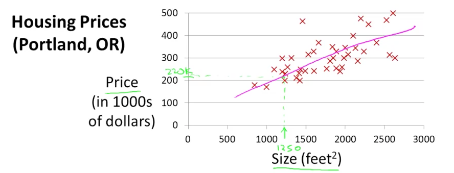
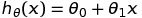

## What is Machine Learning?

Two definitions:

 * **Arthur Samuel** described it as: "the field of study that gives computers the ability to learn without being explicitly programmed."
 * **Tom Mitchell** provides a more modern definition: "A computer program is said to learn from experience **E** with respect to some class of tasks **T** and performance measure **P**, if its performance at tasks in **T**, as measured by **P**, improves with experience **E**."

## Supervised Learning

In **supervised learning**, we are given a data set and already know what our correct output should look like, having the idea that there is a relationship between the input and the output.


Example 1: Housing price prediction

``Supervised Learning``: right answers

``Regression``: Predict continuous valued output (price)

Example 2: Brest cancer (malignant, benign)

``Classification``: Discrete valued output (0 or 1)


## Unsupervised Learning

**Unsupervised learning** allows us to approach problems with little or no idea what our results should look like. We can derive structure from data where we don't necessarily know the effect of the variables.

 * Clustering: grouping genes
 * Non-clustering : Cocktail party problem

Cocktail party problem: Allows you to find structure in a chaotic environment. ([Plots](http://stackoverflow.com/questions/20414667/cocktail-party-algorithm-svd-implementation-in-one-line-of-code))
```
[W, s, v] = svd((repmat(sum(x.*x, 1), size(x, 1), 1).*x)*x');
```

Other applications:

 * Organize computing clusters
 * Social network analysis
 * Market segmentation
 * Astronomical data analysis

## Linear Regression with one variable 

### Model Representation



**Supervised Learning**: Given the "right answer" for each example in the data.

**Regression Problem**: Predict real-valued output (continuous)

**Classfication**: Discrete-valued output

Training set of housing prices

Notation:
* m = Number of training examples
* x's = "input" variable / features
* y's = "output" variable / "target" variable
* (x, y) - one training example
* (x^(i), y^(i)) - ith traning example

```
                       Training Set 
                           |
                    Learning Algorithm 
                           |
Size of house (x) -> h (hypothesis) -> Estimated price (y)

p.s. h maps from x's to y's.
```


How do we represent h?


